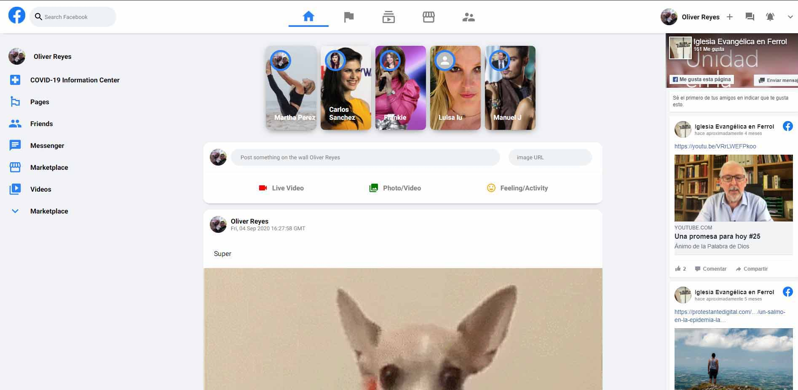

  
  

## Available Scripts

### `npm start`

Runs the app in the development mode. 
Open [http://localhost:3000](http://localhost:3000) to view it in the browser.

this App is deployed on firebase at https://facebook-8de25.web.app/
